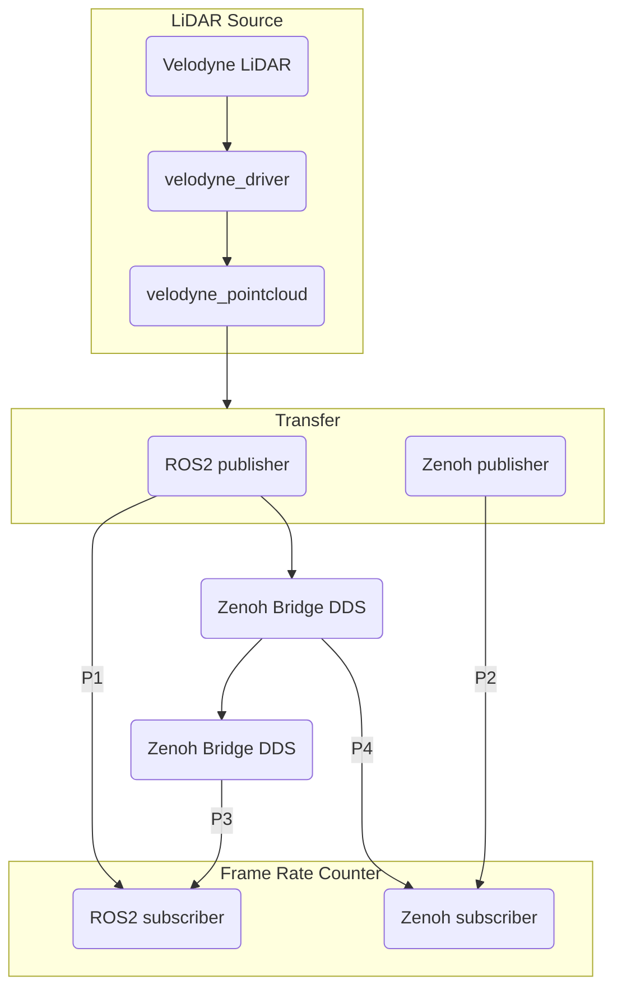
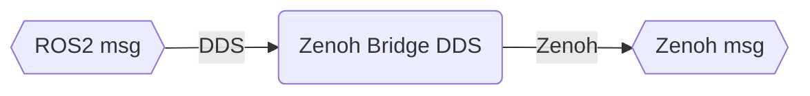
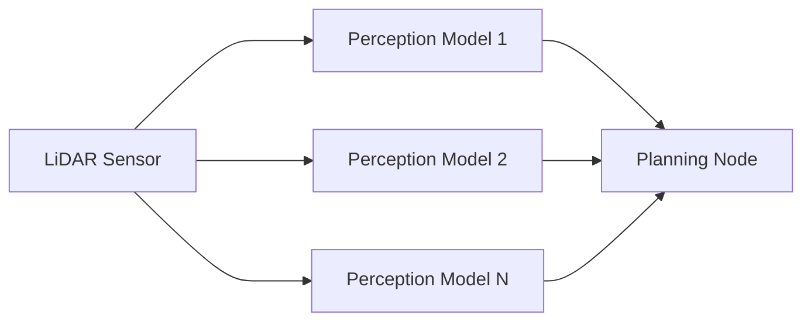
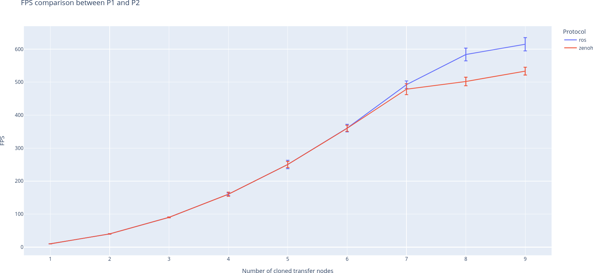

## This is a project to compare the performance of ROS2 point cloud message passing between native DDS and Zenoh.

* ROS Velodyne driver: https://github.com/ros-drivers/velodyne/tree/ros2




Here's a simple visualizaton of the mechanism of [zenoh-bridge-dds](https://github.com/eclipse-zenoh/zenoh-plugin-dds).



There're four pathways to transfer the raw LiDAR packets to the endpoint Frame rate counter.

* P1: the default way used in ROS2, passing messages with DDS
* P2: replacing the last message passing by pure zenoh protocol
* P3: using two Zenoh/DDS bridges to cross the local network
* P4: directly using the zenoh message after Zenoh/DDS bridge


## Prerequisites

1. ROS2 Humble

Make sure you have [ROS2 humble](https://docs.ros.org/en/humble/Installation.html) installed on your system.

2. Download ROS dependencies
```bash
vcs import --input src/ros2.repos src
```

3. Build ROS packages

```bash
source /opt/ros/humble/setup.bash
colcon build
```


4. Download the sample data


```bash
wget https://github.com/YuanYuYuan/ros2-dds-zenoh-comparison/releases/download/2022-12-15/sample-data.tar.xz
tar xvf sample-data.tar.xz
```

5. (Optional) build zenoh router if needed
```
git clone https://github.com/eclipse-zenoh/zenoh
cd zenoh
cargo build --release --bin zenohd
```

## Usage

```bash
source ./env.bash
ros2 bag play sample-data/rosbag2_2022_12_09-21_10_35_0.db3 --loop -r 1
ros2 launch velodyne_pointcloud velodyne_transform_node-VLP32C-launch.py
ros2 launch comparison zenoh_pub.py
ros2 launch comparison zenoh_sub.py
rviz2 -f velodyne
```


## Tips

Setup ccls via cmake _compile_commands.json_.

```bash
colcon build --cmake-args -DCMAKE_EXPORT_COMPILE_COMMANDS=ON
ln -s ./build/compile_commands.json .
```

## Experiments

For autonomous vehicles driving on the road, there is one case of single LiDAR source followed
by multiple perception and then gather into the planning node to make decision.



We can simulate this case by duplicating the middle **Transfer** node.
The following script can be used to compare the performance between the paths P1 and P2.
```bash
./scripts/compare.sh
```

Visualize the results
```bash
python ./scripts/plot.py
```



