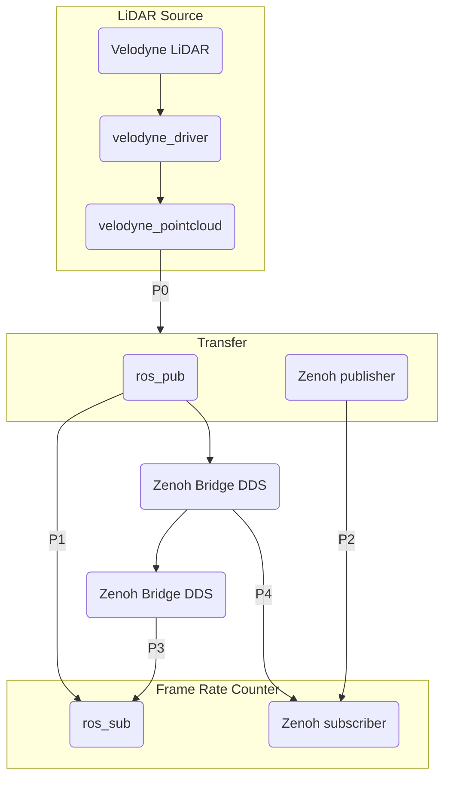

## This is a project to compare the performance of ROS2 point cloud message passing between native DDS and Zenoh.

The version is intended for the cooperation project with NTU & NYCU.



There're four pathways to transfer the raw LiDAR packets to the
endpoint Frame rate counter.

* P0: Raw LiDAR packet from the physical LiDAR sensor
* P1: the default way used in ROS2, passing messages with DDS
* P2: replacing the last message passing by pure zenoh protocol
* P3: using two Zenoh/DDS bridges to cross the local network
* P4: directly using the zenoh message after Zenoh/DDS bridge

In the NTU/NYCU project, the path **P2** is used.

## Prerequisites

- ROS2 Galactic

  Ubuntu/Debian users can refer to the [installation guide](https://docs.ros.org/en/galactic/Installation/Ubuntu-Install-Debians.html).

- Install Rust toolchain from [rustup.rs](https://rustup.rs/).

- Install `zenoh-bridge-dds`.

  Ubuntu/Debian users can follow the `Linux Debian` section in the
  zenoh-plugin-dds project
  [README](https://github.com/eclipse-zenoh/zenoh-plugin-dds#linux-debian).


## Build This Project

Whenever you start a new shell, set up the ROS environment.

```bash
source /opt/ros/galactic/setup.bash
```

Build the packages using `colcon`.

```bash
vcs import --input src/ros2.repos src
colcon build --symlink-install --cmake-args -DCMAKE_BUILD_TYPE=Release
```

## Run this Demo

Prepare two laptops with this project built within. One connects the
the LiDAR and works as a publisher. The other works as a subscriber
receiving the point cloud messages. Both are in a local network.

Whenever you start a new shell, always activate the environment for
this project.

```bash
cd ros2-dds-zenoh-comparison/
source install/setup.bash
```

### Publishing Side

Choose one of two ways to provide the LiDAR data source.

1. Play pre-recorded offline LiDAR packets.


  ```bash
  ros2 bag play sample-data/rosbag2_2022_12_09-21_10_35_0.db3 --loop -r 1
  ros2 launch velodyne_pointcloud velodyne_transform_node-VLP32C-launch.py
  ```

2. Live packets from a LiDAR device.

  ```bash
  ros2 launch velodyne_driver velodyne_driver_node-VLP32C-launch.py 
  ros2 launch velodyne_pointcloud velodyne_transform_node-VLP32C-launch.py
  ```

Then, start the ROS publisher.


```bash
ros2 run comparison ros_pub
```

Start the Zenoh/DDS bridge to forward ROS messages to the Zenoh network.

```bash
zenoh-bridge-dds
```

### Subscription Side

Start the ROS subscriber.

```bash
ros2 run comparison ros_sub
```

Start the Zenoh/DDS bridge to forward ROS messages to the Zenoh network.

```bash
zenoh-bridge-dds
```
