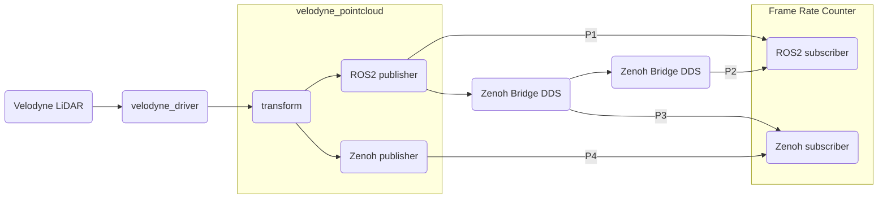
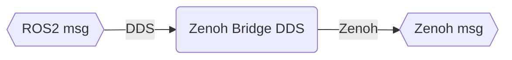

## This is a project to compare the performance of ROS2 point cloud message passing between native DDS and Zenoh.

* ROS Velodyne driver: https://github.com/ros-drivers/velodyne/tree/ros2

Here's a simple visualizaton of the mechanism of [zenoh-bridge-dds](https://github.com/eclipse-zenoh/zenoh-plugin-dds).

There're four pathways to transfer the raw LiDAR packets to the endpoint Frame rate counter.

* P1: the default way used in ROS2, passing messages with DDS
* P2: using two Zenoh/DDS bridges to cross the local network
* P3: directly using the zenoh message after Zenoh/DDS bridge
* P4: replacing the last message passing by pure zenoh protocol
