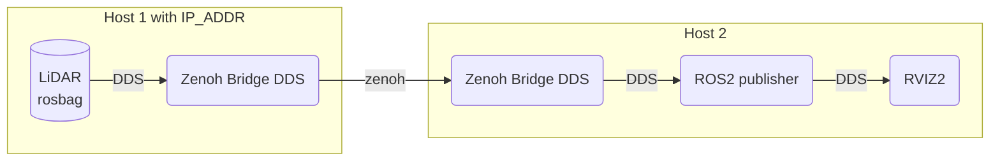
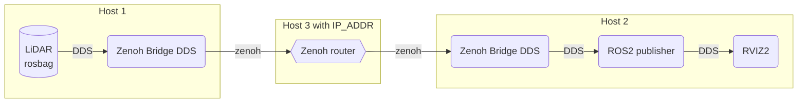

# zenoh-bridge-dds Demo


## Prerequisites

Please check [here](../READMD.md)

## Direct communication


```bash
source ./env.bash && ros2 run zenoh_bridge_dds zenoh_bridge_dds -- -d 1 -l tcp/0.0.0.0:7447
source ./env.bash && ROS_DOMAIN_ID=1 ros2 bag play sample-data/rosbag2_2022_12_09-21_10_35_0.db3 --loop -r 1
```

```bash
source ./env.bash && ros2 run zenoh_bridge_dds zenoh_bridge_dds -- -d 2 -e tcp/IP_ADDR:7447
source ./env.bash && ROS_DOMAIN_ID=2 ros2 launch comparison ros_pub.py
source ./env.bash && ROS_DOMAIN_ID=2 rviz2 -d ./demo/demo.rviz
```

## Communication over an intermidiate zenoh router

Assuming  that host 1 and host 2 can't see each other directly. We can still connect each other via a public zenoh router.



* Host 1

```bash
source ./env.bash && ros2 run zenoh_bridge_dds zenoh_bridge_dds -- -e tcp/IP_ADDR:7447
source ./env.bash && ros2 bag play sample-data/rosbag2_2022_12_09-21_10_35_0.db3 --loop -r 1
```

* Host 2

```bash
source ./env.bash && ros2 run zenoh_bridge_dds zenoh_bridge_dds -- -e tcp/IP_ADDR:7447
source ./env.bash && ros2 launch comparison ros_pub.py
source ./env.bash && rviz2 -d ./demo/demo.rviz
```

* Host 3

Make sure you zenoh router installed as installed in the [prerequisites](../README.md).

```bash
./zenoh/target/release/zenohd
```
